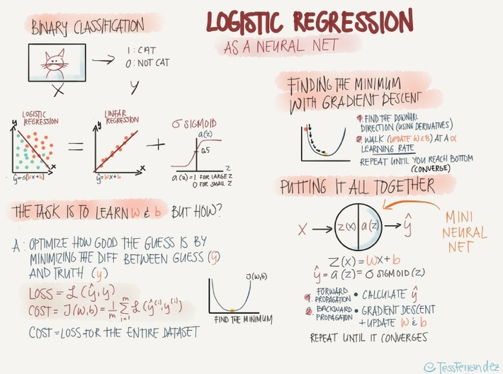

### Ando aprendiendo dataScience y quise hacer mi propia librería de logistic regression.

##### Vi esta foto y quise hacer mi propia librería y pues así va quedando.

#### Ando haciendo estas librerías con los datases de sklearn

## necesitamos los siguientes paquetes para que funke sino F:
- sklearn
- numpy

## como hago correr esto ??? izzi:

python main.py
